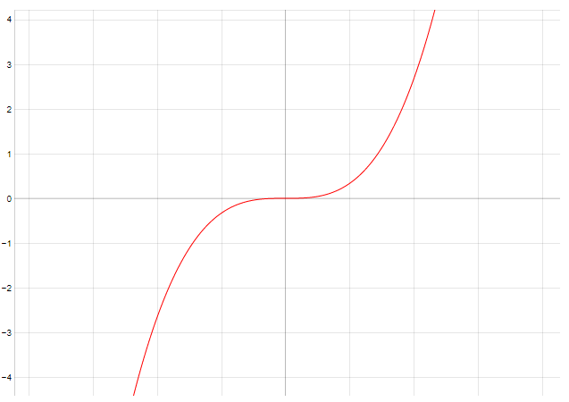

# Intégration Numérique

<div align="center"></div>

## Département Informatique - INM3201
                                                      IUT de Vélizy
                                                Projet de Programmation
_________ 

#### Rectangles "gauches" 

```python
def rectangles_gauches(a, b, n):
    resultat = (b - a) / n
    somme = 0

    for i in range(n):
        somme += f(a)
        a += 1 / n
    resultat = resultat * somme
    return resultat
```
#### Rectangles "droits"
```python
def rectangles_droits(a,b,n):
    resultat = (b - a) / n
    somme = 0
    a += 1/n
    for i in range(1,n+1):
        somme += f(a)
        a += 1 / n
    resultat = resultat * somme
    return resultat
```

#### Rectangles "médians"
```python
def rectangles_medians(a,b,n):
    resultat = (b - a) / n
    somme = 0

    for i in range(0,n):
        somme += f(a + a+(1/n)) / 2
        a += 1 / n
    resultat = resultat * somme
    return resultat
```

#### Méthode des trapèzes
```python
    resultat = ((b - a) / (2*n))
    somme = 0

    for i in range(1,n):
        somme += f(a)
        a += 1 / n
    resultat = resultat * (f(a) + f(b) + 2 *somme)
    return resultat
```

#### Méthode de Simpson
```python
def simpson(a,b,n):
    resultat = ((b - a) / (6*n))
    somme1 = 0
    somme2 = 0

    for i in range(0,n):
        if i == 0:
            somme2 += f(a + ((2*i + 1)*(b-a))/(2*n))
        else:
            somme1 += f(a + (i * (b - a)) / n)
            somme2 += f(a + ((2*i + 1)*(b-a))/(2*n))
    resultat = resultat * (f(a) + f(b) + 2*somme1 + 4*somme2)
    return resultat
```
_________ 

<div align="center"></div>

1) 
(a = 0 ,b = 1 , n = 10)

print("Méthode rectangles médians =" + str(rectangles_medians(0, 1, 10)))

Valeur approchée = 0.33166666666666667
Résultat réel obtenu = 1/12

2)

3)

<div align="center"></div>

<div align="center"></div>
<div align="center"></div>
<div align="center"></div>
<div align="center"></div>

