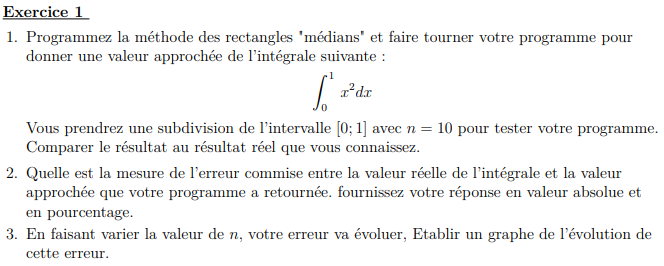
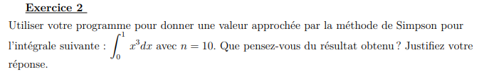
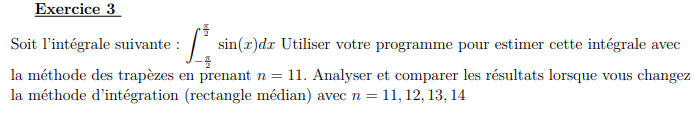
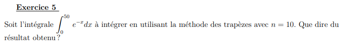

# Intégration Numérique

<div align="center"></div>

## Département Informatique - INM3201
                                                      IUT de Vélizy
                                                Projet de Programmation
_________ 

#### Rectangles "gauches" 

```python
def rectangles_gauches(a, b, n):
    resultat = (b - a) / n
    somme = 0

    for i in range(n):
        somme += f(a)
        a += 1 / n
    resultat = resultat * somme
    return resultat
```
#### Rectangles "droits"
```python
def rectangles_droits(a,b,n):
    resultat = (b - a) / n
    somme = 0
    a += 1/n
    for i in range(1,n+1):
        somme += f(a)
        a += 1 / n
    resultat = resultat * somme
    return resultat
```

#### Rectangles "médians"
```python
def rectangles_medians(a,b,n):
    resultat = (b - a) / n
    somme = 0

    for i in range(0,n):
        somme += f(a + a+(1/n)) / 2
        a += 1 / n
    resultat = resultat * somme
    return resultat
```

#### Méthode des trapèzes
```python
    resultat = ((b - a) / (2*n))
    somme = 0

    for i in range(1,n):
        somme += f(a)
        a += 1 / n
    resultat = resultat * (f(a) + f(b) + 2 *somme)
    return resultat
```

#### Méthode de Simpson
```python
def simpson(a,b,n):
    resultat = ((b - a) / (6*n))
    somme1 = 0
    somme2 = 0

    for i in range(0,n):
        if i == 0:
            somme2 += f(a + ((2*i + 1)*(b-a))/(2*n))
        else:
            somme1 += f(a + (i * (b - a)) / n)
            somme2 += f(a + ((2*i + 1)*(b-a))/(2*n))
    resultat = resultat * (f(a) + f(b) + 2*somme1 + 4*somme2)
    return resultat
```
_________ 

<div align="center"></div>

1) Print("Méthode rectangles médians =" + str(rectangles_medians(0, 1, 10)))

   Valeur approchée = 0.33166666666666667
  
   Résultat réel obtenu = 1/12

2) Valeur absolue = 
  
   Pourcentage = 

3) 
<div align="center"></div>

<hr>
<div align="center"></div>

<u>Réponse:</u>

   Print("Méthode de Simpsons =" + str(simpson(0, 1, 10)))
  
   Valeur obtenue = 0.05000020833333334
   
   Le résultat obtenu se rapproche du résultat réel réalisé sur papier.
   

<hr>
<div align="center"></div>

Réponse:

   Il ne faut pas oublier de mettre " from math import * " afin de pouvoir utiliser "pi" 

   Print("Méthode des Trapèzes =" + str(trapezes(-pi/2, pi/2, 11))) = 3.9294565709371456
 
   Print("Méthode rectangles médians =" + str(rectangles_medians(-pi/2, pi/2, 11))) = 0.7151451704902102
   
   Print("Méthode rectangles médians =" + str(rectangles_medians(-pi/2, pi/2, 12))) = 0.7149877738663666
   
   Print("Méthode rectangles médians =" + str(rectangles_medians(-pi/2, pi/2, 13))) = 0.7148653158421161
   
   Print("Méthode rectangles médians =" + str(rectangles_medians(-pi/2, pi/2, 14))) = 0.7147681700425113
   
<hr>
<div align="center"></div>

Réponse:

   Print("Méthode des Trapèzes =" + str(trapezes(0, 1, 10000))) = 0.8332333499994032
   
   Il n'y a aucun intérêt de la valeur de n choisie avec cette méthode car elle varie très peu en fonction de n.
   
<hr>
<div align="center"></div>

Réponse:
   Print("Méthode des Trapèzes : " + str(trapezes( 0, 50, 10))) = -32.19623915708445


RESTE A FAIRE UN TABLEAU AVEC LES FONCTIONS DE BASES ET LEURS PRIMITIVES
COMPLETER LES QUESTIONS ET AMELIORER LE RAPPORT !!!!!
