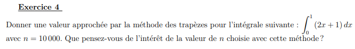

# Intégration Numérique

<div align="center"></div>

## Département Informatique - INM3201
                                                      IUT de Vélizy
                                                Projet de Programmation
_________ 

#### Rectangles "gauches" 

```python
def rectangles_gauches(a, b, n):
    resultat = (b - a) / n
    somme = 0

    for i in range(n):
        somme += f(a)
        a += 1 / n
    resultat = resultat * somme
    return resultat
```
#### Rectangles "droits"
```python
def rectangles_droits(a,b,n):
    resultat = (b - a) / n
    somme = 0
    a += 1/n
    for i in range(1,n+1):
        somme += f(a)
        a += 1 / n
    resultat = resultat * somme
    return resultat
```

#### Rectangles "médians"
```python
def rectangles_medians(a,b,n):
    resultat = (b - a) / n
    somme = 0

    for i in range(0,n):
        somme += f(a + a+(1/n)) / 2
        a += 1 / n
    resultat = resultat * somme
    return resultat
```

#### Méthode des trapèzes
```python
    resultat = ((b - a) / (2*n))
    somme = 0

    for i in range(1,n):
        somme += f(a)
        a += 1 / n
    resultat = resultat * (f(a) + f(b) + 2 *somme)
    return resultat
```

#### Méthode de Simpson
```python
def simpson(a,b,n):
    resultat = ((b - a) / (6*n))
    somme1 = 0
    somme2 = 0

    for i in range(0,n):
        if i == 0:
            somme2 += f(a + ((2*i + 1)*(b-a))/(2*n))
        else:
            somme1 += f(a + (i * (b - a)) / n)
            somme2 += f(a + ((2*i + 1)*(b-a))/(2*n))
    resultat = resultat * (f(a) + f(b) + 2*somme1 + 4*somme2)
    return resultat
```
_________ 

<div align="center"></div>

1) Print("Méthode rectangles médians =" + str(rectangles_medians(0, 1, 10))) = 0.665

   Valeur de F(1) = 1/3 = 0.33166666666666667

2) Valeur absolue = |0,3| 
  
   Pourcentage = 90%
   
   On remarque une différence de 0 3 u.a

3) 
<div align="center"></div>

<hr>
<div align="center"></div>

<u>Réponse:</u>

   Print("Méthode de Simpsons =" + str(simpson(0, 1, 10)))
  
   Valeur obtenue = 1/4 soit 0.25
   
   Le résultat obtenu se rapproche du résultat réel réalisé sur papier car l intégrale de x^3 est x^4/5.
   

<hr>
<div align="center"></div>

Réponse:

   Il ne faut pas oublier de mettre " from math import * " afin de pouvoir utiliser "pi" 

   Print("Méthode des Trapèzes =" + str(trapezes(-pi/2, pi/2, 11))) = -2.4768
 
   Print("Méthode rectangles médians =" + str(rectangles_medians(-pi/2, pi/2, 11))) = -2.6444
   
   Print("Méthode rectangles médians =" + str(rectangles_medians(-pi/2, pi/2, 12))) = -2.6443
   
   Print("Méthode rectangles médians =" + str(rectangles_medians(-pi/2, pi/2, 13))) = -2.6442
   
   Print("Méthode rectangles médians =" + str(rectangles_medians(-pi/2, pi/2, 14))) = -2.6441
   
   On remarque une faible différence entre chaque méthode et que tous les résultats sont tous négatifs.
   
<hr>
<div align="center"></div>

Réponse:

   Print("Méthode des Trapèzes =" + str(trapezes(0, 1, 10000))) = 1.9999
   
   L'intérêt d'une valeur de "n" aussi grande est une précision beaucoup plus acrrue de la valeur retournée.
   
<hr>
<div align="center"></div>

Réponse:
   Print("Méthode des Trapèzes : " + str(trapezes( 0, 50, 10))) = 32.19623915708445

#### PRIMITIVES

|      f(x)     |       F(x)    |

| ------------- |:-------------:|

| x²            |     x^3/3     |

| x³            |     x^4/4     |

| sin(x)        |     -cos(x)   | 

| (2x+1)        |     x²+x      | 

| e^-x          |     e^-x      | 
